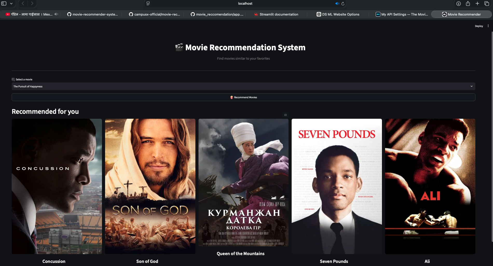
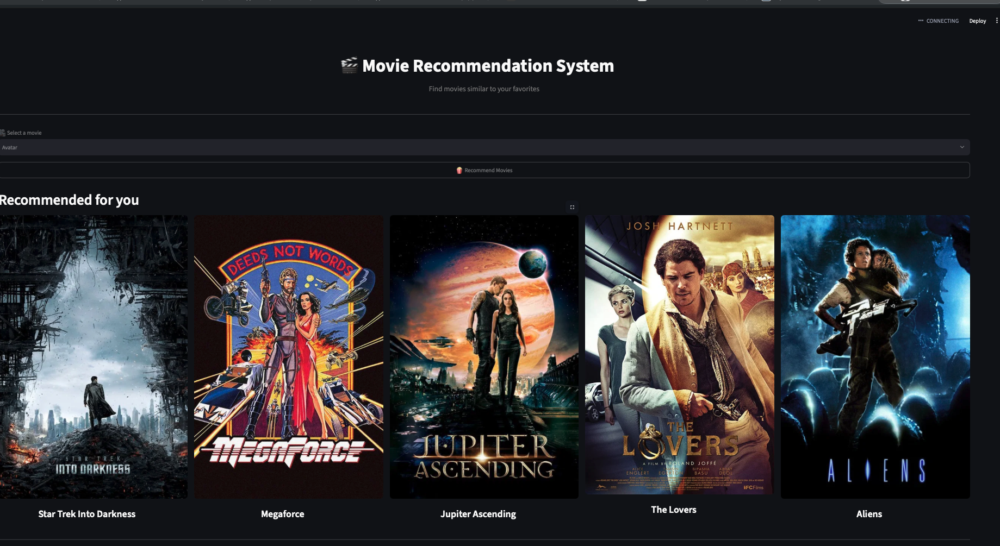

# 🎬 Movie Recommendation System


This is a content-based Movie Recommendation System that I built using Python, Machine Learning, and Streamlit.

The user can select a movie, and the system recommends 5 similar movies. I also connected the projec the TMDB API to display posters for the recommended movies.

## 📌 About the Project

The main goal of this project was to understand how recommendation systems work and turn a Machine Learning project into an interactive web application.

For the recommendation system, I used movie information such as:

- Genres
- Keywords
- Cast
- Crew
- Overview

I cleaned and processed these features and combined them to represent each movie.

After preprocessing, I converted the movie data into vectors and used **cosine similarity** to calculate how similar the movies are.

When the user selects a movie, the system finds the 5 most similar movies and displays them with their posters.
 
### Movie Recommendation System
 
 



## 🚀 Features

- Select a movie from the movie list
- Get 5 similar movie recommendations
- Display movie posters using the TMDB API
- Interactive web interface built with Streamlit
- Content-based movie recommendation

## 🛠️ Technologies Used

- Python
- Pandas
- Scikit-learn
- Streamlit
- TMDB API
- CountVectorizer
- Cosine Similarity
- Pickle
- Git & GitHub

## 🧠 How It Works

The recommendation process is:

1. Clean and preprocess the movie dataset
2. Extract important movie features
3. Combine the features into tags
4. Convert the tags into vectors using CountVectorizer
5. Calculate similarity using cosine similarity
6. Find the 5 most similar movies
7. Fetch movie posters from the TMDB API
8. Display the results using Streamlit

## ▶️ Run the Project Locally

Clone the repository:

```bash
git clone https://github.com/LotusNyaupane/movie_reccomendation.git
```

Install the required libraries:

```bash
pip install pandas scikit-learn streamlit requests
```

Run the Streamlit application:

```bash
python -m streamlit run app.py
```

## 🔐 TMDB API

I used the TMDB API to retrieve movie posters.

For security, the API key is not stored in the GitHub repository.

Create:

```text
.streamlit/secrets.toml
```

and add your own TMDB API key:

```toml
TMDB_API_KEY = "your_api_key"
```

## 📚 What I Learned

##Some of the Results i found 


While building this project, I learned more about:

- Data cleaning and preprocessing
- Feature engineering
- Text vectorization
- Cosine similarity
- Recommendation systems
- Working with APIs
- Building a web interface with Streamlit
- Using Git and GitHub for version control

## 🌐 Deployment

I am currently preparing the application for deployment with Streamlit Community Cloud.

## 👨‍💻 Author

**Lotus Nyaupane**

Machine Learning & Data Science Student